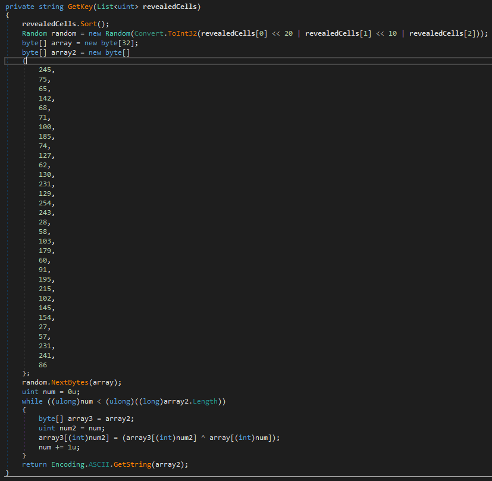

# Solution
I was given a Minesweeper .NET game. It gives us the flag if we solve it one time at least.

Decompling this binary we can see 2 interesting functions in the main class: `GetKey` and `AllocateMemory`<br/>
The first one calulates the flag based on coordinates of the squares clicked as seed. We have a 30x30 board and there is just 3 valid squares.<br/>
Having this function we can bruteforce all possible combinations to get the right one, but this approach would take too much time. We can do better.<br/>



The second function takes care of allocating all the mines. The winning idea is to debug it and set a breakpoint where the local `flag` is false to see where the mines are not set.<br/>
At this point we can save `num1` and `num2` locals as x and y board coordinates (+1 because they start from 0).


At this point we have:

```
X: 8 Y: 29
X: 21 Y: 8
X: 29 Y: 25
```

Now use these coordinates to win:


