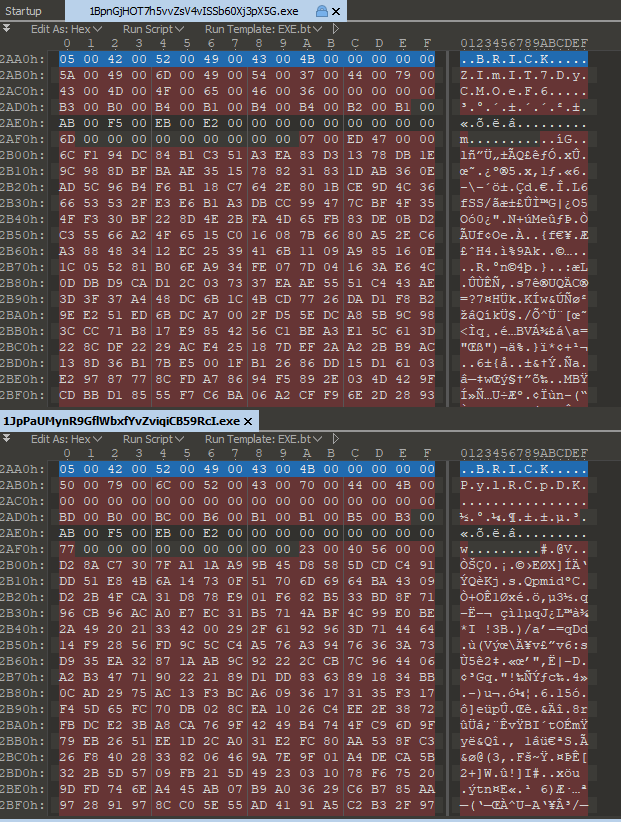

# Solution

I was given 48 32-bit PE binaries.

I started analyzing the first one and i've noticed it behaves like a normal crackme.<br/>
It asks for a password then prints `Go step on a brick!` if the password is wrong and `Oh, hello Batman...` if your password is `IronManSucks`.<br/>
The password check is at `0x00401240`, the first part of it checks for the `IronManSucks` string which is obviously the wrong one, the second part checks for the right password instead.<br/>
At this point password is loaded at runtime, so we can't see it through static analysis. To get it we have to go back at main.<br/>
The second called function in main is the most intersting one, it calls another function and then copies the bytes recieved into the password memory location. The called function loads a resource (`BRICK`) through some win apis then it exits.<br/>
I've debugged the binary and i realized the resource loaded is the right password.<br/>
Submitting that password the output is 

```
Everything is awesome!
65141174.png => w
```
Also a png image is decompressed and put into the same binary folder.<br/>
Through binary diffing i was able to understand that all biaries are equal, they differs only by resource section.



So now i have to script something for extarcting all the pngs and all the outputs. I choose python for this:

```python
import os, subprocess

BINARIES_PATH = 'C:\\Users\\bbian\\Desktop\\FlareOn5_Challenges\\03_FLEGGO\\FLEGGO'

def shell(command):
    try:
        output = subprocess.check_output(command, shell=True, stderr=subprocess.STDOUT)
    except Exception, e:
        output = str(e.output)
    return output.split('\n')

def get_pswd(binary):
    pswd = ''
    bina = open(binary, 'rb').read()
    i = 0x2ab0 #password fixed position
    while bina[i] != chr(0):
        pswd += bina[i]
        i += 2
    return pswd

binaries = os.listdir(BINARIES_PATH)

for pe in binaries:
    pe = BINARIES_PATH + '\\' + pe
    out = shell('echo %s | %s' % (get_pswd(pe), pe))
    print out[2]
```

Output:

```
65141174.png => w
85934406.png => m
67782682.png => m
75072258.png => r
16544936.png => e
67322218.png => _
58770751.png => o
64915798.png => 3
88763595.png => e
18376743.png => _
36870498.png => m
72501159.png => c
47619326.png => p
70037217.png => m
18309310.png => @
15566524.png => e
82100368.png => m
60075496.png => s
71290032.png => a
33718379.png => .
42255131.png => t
16295588.png => a
61333226.png => f
13147895.png => w
16785906.png => 4
80333569.png => o
37723511.png => n
44958449.png => _
30171375.png => s
72263993.png => h
82236857.png => e
33098947.png => _
33662866.png => r
47893007.png => _
61006829.png => l
89295012.png => 0
87730986.png => 0
65626704.png => 3
72562746.png => -
36494753.png => 0
79545849.png => s
63223880.png => a
51227743.png => a
73903128.png => u
52817899.png => n
19343964.png => o
12268605.png => s
47202222.png => n
```

Every image has a number on the top-left corner, if we order output characters based on that number we have the flag: `mor3_awes0m3_th4n_an_awes0me_p0ssum@flare-on.com`
