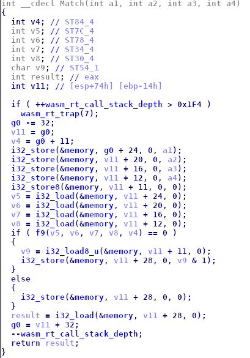

# Solution

I was given 3 files: `index.html`, `main.js` and `test.wasm` 
`index.html` just imports `main.js`.
Opening `main.js` i was presented a javascript code which seems to load `test.wasm` and execute it. This code is well commented so it wasn't hard to understand it. 
The javascript code takes a parameter called `q`, endcode it in an array, loads another array of predefined values and write those 2 arrays to the wasm memory. 
The function `Match` of `test.wasm` is called and then it prints "💩" if the `q` parameter input is wrong, "🎉" if it is right. 
Summarising it's a web assembly crackme.

I didn't want to look at webasm opcodes directly so i used [wasm2c](https://github.com/WebAssembly/wabt/tree/master/wasm2c) to convert the code into a readable c. 
This is how Match function looks like: 

Match (and also the others functions) use stack variables in an intricated way, there is a lot of redundance in it which makes the code hard to understand. 
The idea i had was to compile that code with gcc and then decompile it using IDA +  Hexrays decompiler plugin which optimize the code. 
That's how match looks like now: 

`i32_store` stores the given parameter (must be a 32 bit local) into web assembly memory at the given address. 
`i32_load` does the opposite. 
As we can seen the whole logic of this crackme is implemented in the `f9` function. 
This funtion looks intricated even if it was optimized, but it's easy to undersand at least. 

At line 83 we have a dynamic call which does the real check of single charaters of the flag. 
I didn't analyze every function called because i realized i can dump flag charaters using Google Chrome console. 

If we look cautiously at `f9` we can see the indeirect call at line 244. 
The right charatcer is loaded in local#72 at line 264, so to solve it i set a breakpoint onto line 265 and manually dump local 72. 
Flag is: `wasm_rulez_js_droolz@flare-on.com`

