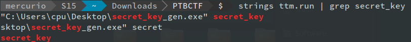
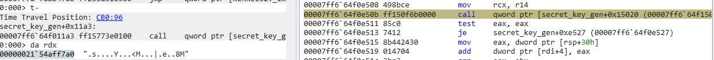

Challenge description:
>You know those challenges where you get the source code, you have everything before your eyes and then you spot that line flag = "REDACTED or key = "REDACTED ?
>
>Fortunately, today we're finally releasing The Time Machine. Travel in time and get back that key!
>
>Note: make sure to Google stuff before reinventing the wheel!
>
>Note2: the flag format is slightly messed up


We're given 2 files: a python script and a WinDbg debug trace.

Let's take a look to the python file:

```python3
from Crypto.Cipher import AES
from Crypto.Util import Counter
from os import urandom

with open("secret_key", "rb") as key_file_fd:
    KEY = key_file_fd.read(16)

with open("flag") as flag_fd:
    FLAG = flag_fd.readline().strip()

print("key =", bytes.hex(KEY), "length =", len(KEY))
# key = REDACTED length = 16
nonce = urandom(8)
print("nonce =", bytes.hex(nonce))
# nonce = f0d27667d7000df9
ctr = Counter.new(128, initial_value=int.from_bytes(nonce, "big"))
aes_cipher = AES.new(KEY, AES.MODE_CTR, counter=ctr)
flag = FLAG.encode("utf-8")
enc_flag = aes_cipher.encrypt(flag)
print("encrypted flag =", bytes.hex(enc_flag))
# encrypted flag = 63242f9d6c4c748231602c990c0b6a51dbc0ca0ea0f26a780fe613
```

This script gives us an encrypted flag a nonce and tell us what we are looking for: the secret key.

Let's do some blackbox stuff like grepping for `secret_key` to see if we can extract some information before dealing with WinDbg.



Now we know the trace comes from a binary called `secred_key_gen.exe` and the secret key comes from there too!

So, open it in winDbg and see how the key is generated. We can easily guess at this point the binary traced uses the `WriteFile` WinAPI from `Kernel32.dll` to write the key. So just enter `bp kernel32!WriteFile` in windbg an then `g` to start the execution of the trace.

The first time we hit the breakpoint we have `--== TTM (beta) ==--` in `rdx`, if we try to decrypt with this string we fail.

Let's try the second one: this time in `rdx` we have a non printabke stream of bytes which could be our key. Here's the screenshot:



This time we got right, decrypting the flag with this key lead us to `ptbctf{t1m3_1s_4n_1llus10n}`. 