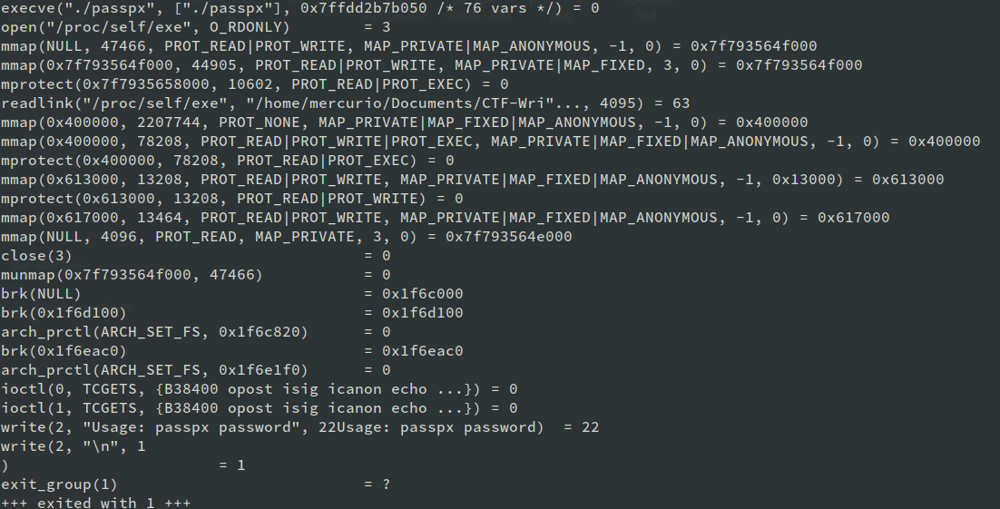
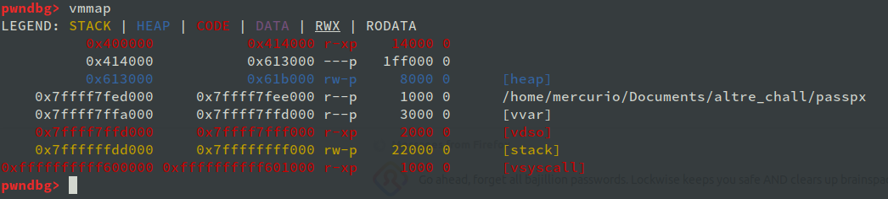
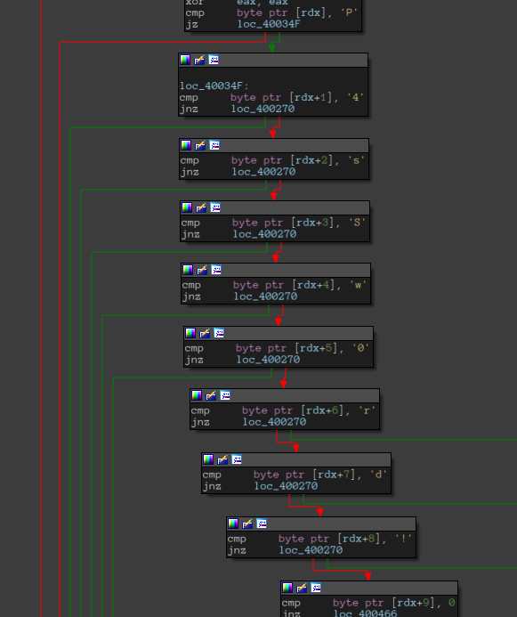

Challenge description:

> Check out our new packer, now with password protection.

This crackme is packed with a custom version of UPX and it cannot be unpacked using the `-d` command, so we have to unpack it manually.

Let's run `strace` to see what's going on.

This binary could be unpacked dynamically by catching the `munmap` syscall in `gdb` and dumping the original sections, but we would end up with a crackme without the real password check. we can't skip the unpacking routine.

Let's do it anyway just for the seek of seeing where the `Try harder` come from.

The steps are:
1. `catch syscall munmap`, put a catchpoint to the syscall
2. `r AAA`, run it with a random password
3. `s 3`, step 3 times
4. `vmmap` or `info proc map`, look for memory mappings

The output should look like this:

The addresses starting like `0x7ffff7f..` are packer stuff, we don't care about them yet. Dump the other part by entering `dump mem passpx_dump0.bin 0x400000 0x613000`.

Open `passpx_dump0.bin` in IDA. We can see tons of functions here, most of them come from statically linked libraries so we don't have to worry about.
The main is at `0x4001a0`.

What's stands out here is the password check:

If we pass the string `PasSw0rd!` to the binary as argument it prints `Try harderer`, so this check is cleary fake.

If those jumps are not taken the string `Try harder` is decrypted (using a simple xor loop) and then printed.
There is another check before, just in case `arg[1]` is missing, this one ends printing the _usage stuff_.

So, where is the real password check?

In order to find the right password check we need to analyze the unpacking routine and step into the entry of the unpacked code.
Debugging a little bit it's possible discover at `0x00409f44` the `jmp r13` instruction leads to a code with weird addresses like `0x7fff..`, and that's where the unpacker starts to execute its code. Let's dump the packer sections and then reverse them statically using IDA.

There is a lot of code in [the new dump](passpx_dump1.bin), mostly hidden due to the fact it's just a memory dump. This binary doesn't have an ELF header, so it's not so friendly to disassemble/decompile.
Poking around a little bit leads to some interesting functions:
* `0x113a`, calculates the md5 of a string
* `0x1af4`, checks the 5th argument against an hardcoded hash
* `0x10c6`, memmap syscall
* `0x1120`, equivalent of memcopy
* `0x18d7`, returns an harcoded hash
* `0x199c`, wrapper for `0x113a`

...and so on

All these functions are some way related to the `0x2438` one which is where the real password check starts.

Tracking how the data flows through the functions we can notice all the code can be reduced to `md5(password)=e6442d0a7c15507e62753e5e044e5dcd` (look at `0x1af4`). 

Unfortunately that hash is uncrackable, but we can debug the binary and force the check (moving the `rip` register) to see what's next.
At this point, stepping forward, we can see the unpacked binary is changed and then the flag is printed: `PTBCTF{8d4f4168500acd66e65c921a694e15dd2e862e5f}`.
